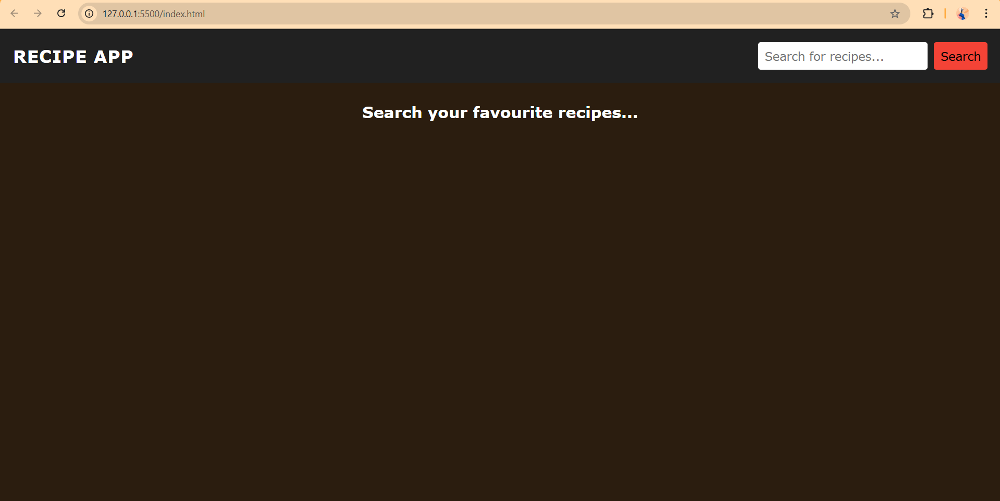
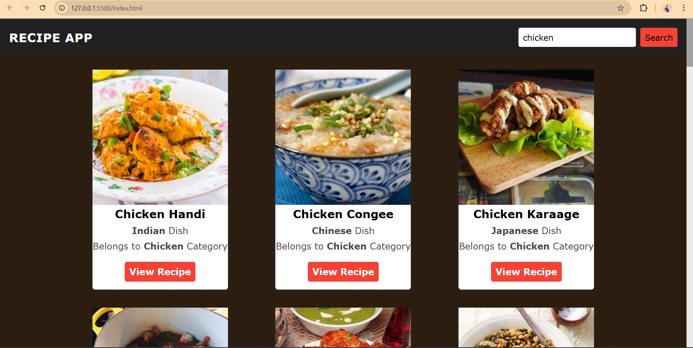
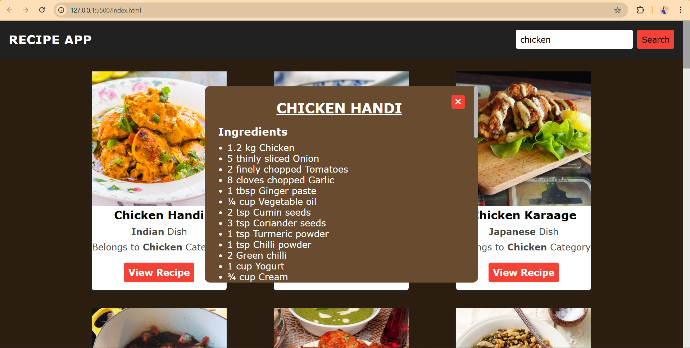
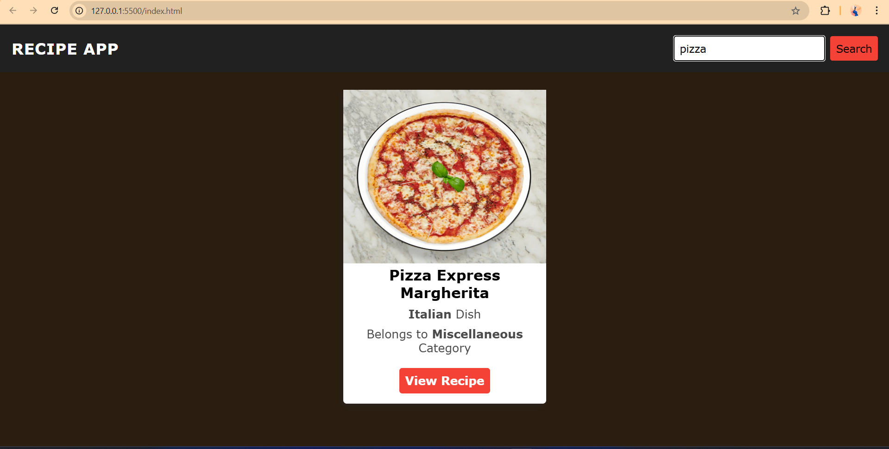
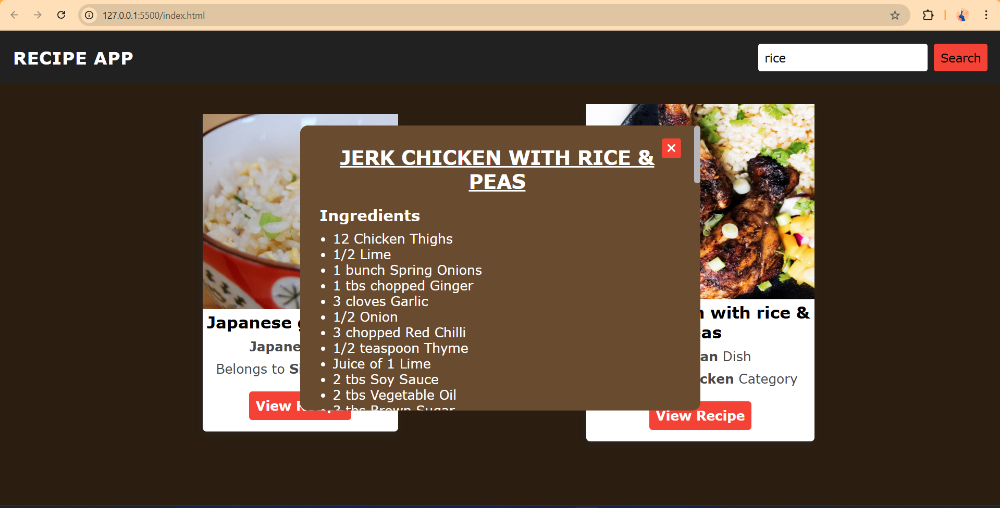

# recipe-app-using-HTML-CSS-JavaScript

A **Recipe Finder Web Application** built with **HTML5**, **CSS3**, and **Vanilla JavaScript** that lets food‑lovers search thousands of dishes, browse mouth‑watering photos, and reveal ingredient lists in a slick pop‑up — all via the free [TheMealDB API](https://www.themealdb.com/api.php).

---

## 🚀 Features

- 🔍 **Instant recipe search** by keyword (powered by TheMealDB)  
- 🗂️ Displays **dish photo, name, area (cuisine), category** & quick “View Recipe” button  
- 🍴 **Scrollable modal** showing full ingredients list (and, if desired, cooking instructions)  
- 💾 **Lightweight, framework‑free** — pure HTML/CSS/JS  
- 📱 **Responsive card grid** that adapts to mobile, tablet & desktop  
- ✅ **Graceful error handling** if no meals match the search term  

---

## 📸 Preview

### 🖼️ Screenshot 1 – Landing Page (no search yet)  

### 🖼️ Screenshot 2 – Search Results Grid (“chicken”)  

### 🖼️ Screenshot 3 – Recipe Modal (“Chicken Handi” ingredients)  

### 🖼️ Screenshot 4 – Single Result (“pizza”)  

### 🖼️ Screenshot 5 – Another Recipe Modal (“Jerk Chicken with Rice & Peas”)  

---

## 🎥 Demo

📽️ **See the app in action:**  
[🎬 Click to watch](./videoRec.mp4)

---

## 📂 Project Structure

├── index.html # Markup
├── style.css # Styling & responsiveness
├── script.js # API calls & DOM logic
├── Screenshot1_Landing.png
├── Screenshot2_Results.png
├── Screenshot3_Modal.png
├── Screenshot4_SingleResult.png
├── Screenshot5_Modal2.png
├── videoRec.mp4 # Demo video
└── README.md # Project documentation

---

## 🧠 What I Learned

- **Fetching asynchronous data** with `fetch` and handling JSON responses  
- Dynamically **building & updating DOM elements** (cards, modals) from API data  
- Implementing **scroll‑locking modals** with pure CSS/JS  
- Designing a **clean, responsive card layout** without any CSS framework  
- Managing **edge‑cases** (empty search, API errors) to improve UX  

---

If this project helped you, drop a ⭐, fork it, or suggest improvements.  
Happy coding !!
